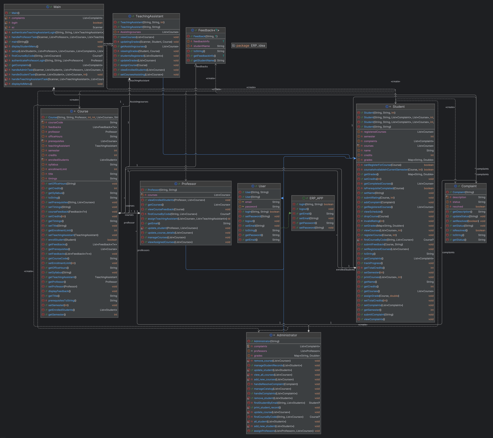

# University Course Registration System

## Overview
This repository contains the implementation of a **University Course Registration System** using **Object-Oriented Programming (OOP)** principles in **Java**. It is designed to manage student enrollments, schedules, academic records, and other university-related tasks efficiently. The system incorporates advanced programming concepts such as generic programming, exception handling, and inheritance to enhance its functionality and robustness.

## Repository Name
`University-Course-Registration-System`

## Features
### Core Functionalities
#### Student Features:
- **View Available Courses:**
  - Displays all available courses for the current semester.
  - Shows details such as course code, title, professor, credits, prerequisites, and timings.
- **Register for Courses:**
  - Ensures students meet prerequisites before registering.
  - Enforces a maximum credit limit of 20 per semester.
  - Allows students to register only for courses in their current semester.
- **View Schedule:**
  - Displays a weekly schedule, including class timings, locations, and professor details.
- **Track Academic Progress:**
  - Displays grades for completed courses.
  - Calculates and shows SGPA (Semester Grade Point Average) and CGPA (Cumulative Grade Point Average).
- **Drop Courses:**
  - Allows students to drop courses during the semester.
  - Optionally supports deadlines for dropping courses.
- **Submit Complaints:**
  - Enables students to submit complaints or raise issues.
  - Complaints include a description and a status (Pending or Resolved).
- **Provide Feedback:**
  - Allows students to give numeric ratings and textual feedback for completed courses.

#### Professor Features:
- **Manage Courses:**
  - Allows professors to view and update course details such as syllabus, timings, credits, and prerequisites.
  - Professors can manage course enrollments within limits set by administrators.
- **View Enrolled Students:**
  - Lists students enrolled in their courses with academic standing and contact details.
- **View Feedback:**
  - Professors can access feedback provided by students for their courses.

#### Administrator Features:
- **Manage Course Catalog:**
  - Enables adding, viewing, and deleting courses from the catalog.
- **Manage Student Records:**
  - Facilitates updating student grades, records, and personal information.
- **Assign Professors to Courses:**
  - Matches professors to courses based on their expertise and availability.
- **Handle Complaints:**
  - Allows administrators to view, update, and resolve student complaints.

#### Teaching Assistant Features:
- **Assist in Grading:**
  - Teaching assistants (TAs) can view and manage grades for students in their assigned courses.
  - Inherits functionalities from the Student role with additional grading capabilities.

### Enhanced Functionalities
1. **Generic Feedback System:**
   - Feedback is managed using a generic class, allowing it to store and process different types of feedback (numeric ratings or textual comments).
   - Improves modularity and efficiency in handling feedback data.

2. **Teaching Assistant Role:**
   - TAs are implemented as an extension of the Student class using inheritance.
   - They support professors in grading but cannot modify course details.

3. **Robust Exception Handling:**
   - Custom exceptions include:
     - `CourseFullException` for when a student tries to register for a full course.
     - `InvalidLoginException` for incorrect login attempts.
     - `DropDeadlinePassedException` for attempting to drop courses after the allowed deadline.
   - Exceptions are handled with clear and descriptive error messages using try-catch blocks.

## UML Diagram
The UML diagram below illustrates the structure and relationships of the system, highlighting its adherence to OOP principles like encapsulation, inheritance, polymorphism, and abstraction.



## How to Run the Code
### Setup:
1. Clone the repository:
   ```bash
   git clone <repository-url>
   cd University-Course-Registration-System
   ```
2. Ensure you have a Java Development Kit (JDK) installed.

### Compile the Code:
Run the following command in the terminal:
```bash
javac Main.java
```

### Execute the Application:
```bash
java Main
```

### Follow the Menu-Driven Interface:
- Log in as a Student, Professor, Administrator, or Teaching Assistant.
- Access and perform functionalities specific to your role.

## Directory Structure
```
project/
├── src/                 # Source files for core functionalities
├── include/             # Header files
├── data/                # Sample input/output files
├── UML/                 # UML diagrams
├── tests/               # Test cases and scripts
├── README.md            # Documentation
└── Main.java             # Entry point of the application
```

## Assumptions
- Maximum credit limit per semester is 20.
- Courses can be either 2 or 4 credits.
- Complaints are manually updated by administrators.
- Teaching Assistants inherit all student functionalities and add grading capabilities.

## Future Enhancements
- **Database Integration:**
  - Persistent storage for user data and course records.
- **Advanced Search Features:**
  - Filters for courses based on professor, timing, prerequisites, or student reviews.
- **Enhanced Security:**
  - Encryption for sensitive data like passwords.
- **GUI Implementation:**
  - Transition to a graphical interface for improved user experience and accessibility.

## Authors
- **Arnav Adarsh**
- Developed as part of **Advanced Programming (CSE201)** coursework.

---
This project demonstrates a robust application of OOP principles while providing a scalable and flexible solution for university course management systems.
